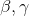
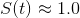
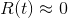
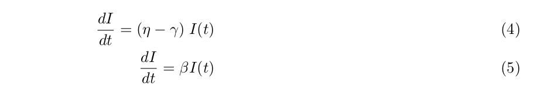
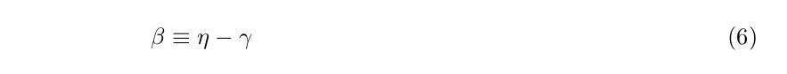
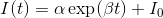

# Wuhan Coronavirus Epidemic
As the number of infected cases and deaths keep rising, it's instructive to gain a statistical perspective on the on-going coronavirus epidemic in Wuhan, China. This repo provides the modeling tool to make daily prediction. 

My goal is to make a daily update of the model as new data become available so that the rate of contagion could be assessed. 

Epidemiological studies on the 2003 SARS epidemic can be found in [1], [2], and [3]. A discussion of the standard models can be found in [4].

### Data Sources
The official source of data is from 中华人民共和国国家卫生健康委员会 (National Health Commission of the PRC) or 卫健委.

http://www.nhc.gov.cn/xcs/yqtb/list_gzbd.shtml

I use the summary table from [Wiki](https://en.wikipedia.org/wiki/Timeline_of_the_2019%E2%80%9320_Wuhan_coronavirus_outbreak).

A nice visualization can be found [here](https://gisanddata.maps.arcgis.com/apps/opsdashboard/index.html#/bda7594740fd40299423467b48e9ecf6).

I capture the Wiki table and save it in `corona_data.csv`, which could be read into R. 

### Model

I use a simplified version of the SIR model, which is a standard formulation of disease transmission dynamics[4]. In a SIR model, we track the time progression of three populations, namely, the susceptible, denoted by the variable S, the infective, or the variable I, and the removed, or R. If a person is healthy and has not contracted the epidemic, he/she belongs to class S. A sick person is in I, while the class R includes both the dead and those who have recovered from and thus are immune to the disease.

The three state variables obey the following coupled non-linear differential equations,

where  are the parameters of the model, t a discrete time index, and the state variables are fraction of the total population so that .

We could make a simplifying assumption in the case of Wuhan. Since the population in question is large, the impact of the infection is insignificant relative to the size of the population. In a country of 1.4 billion, the current number of deaths from coronavirus is not even 0.01 percent of the population. Therefore, , and . We could drop Equation (1) and (3), and Equ (2) becomes,

where I define,

which by elementary calculus yields the solution,

### Results

### Interpretation

### Install
To install R, press Ctrl+Alt+T to open a terminal

    sudo apt-get update 
    sudo apt-get install r-base

### Dependencies
Code has been tested on 
* R 3.6.0
* Ubuntu 18.04 

### Usage
Open a terminal, 

    Rscript coronavirus.R

### Contact
To ask questions or report issues, please open an issue on the [issues tracker](https://github.com/htso/Wuhan/issues).

References

[1] Dye, C., & Gay, N. (2003). Modeling the SARS epidemic. Science, 300(5627), 1884-1885.

[2] Brauer, F. (2006). Some simple epidemic models. Mathematical Biosciences & Engineering, 3(1), 1.

[3] Naheed, A., Singh, M., & Lucy, D. (2014). Numerical study of SARS epidemic model with the inclusion of diffusion in the system. Applied Mathematics and computation, 229, 480-498.

[4] Newman, M. E. (2002). Spread of epidemic disease on networks. Physical review E, 66(1), 016128.

