# Wuhan Coronavirus Epidemic

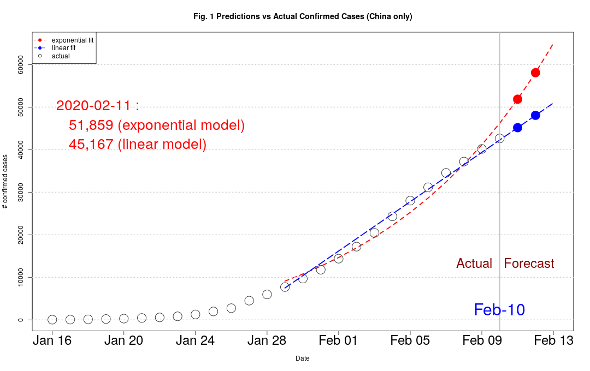

| Date       | Actual | Predict | Delta |   %   |
| -----------|--------|---------|-------|----------|
| 2020-01-28 | 5,974 |  	6,809 |	-835 |	-13.98 |
| 2020-01-29 |	7,711 |  	8,884 |	-1,173 |	-15.21 |
| 2020-01-30 |	9,692 |	   11,041 |	-1,349 |	-13.92 |
| 2020-01-31 |	11,791 |	13,415 |	-1,624 |	-13.77 |
| 2020-02-01 |	14,380 |	15,888 |	-1,508 |	-10.49 |
| 2020-02-02 |	17,205 |	18,837 |	-1,632 |	-9.49 |
| 2020-02-03 |	20,438 |	22,112 |	-1,674 |	-8.19 |
| 2020-02-04 |	24,324 |	25,815 |	-1,491 |	-6.13 |
| 2020-02-05 |	28,018 |	30,196 |	-2,178 |	-7.77 |
| 2020-02-06 |	31,161 |	34,645 |	-3,484 |   -11.18 |
| 2020-02-07 |	34,546 |	38,619 |	-4,073 |   -11.79 |
| 2020-02-08 |	37,198 |	42,490 |	-5,292 |   -14.23 |

#### Update (2/6/2020) 
Confirmed cases rising much slower than the exponential model predicted. 

#### Update (2/5/2020) 
We see a big _slowdown_ in confirmed cases today. Positive.

#### Update (2/1/2020) 
**_Observation_** : Actual has been consistently lower than model prediction. See table below and Fig. 1.  

**_What it means_** : Spread of the coronavirus is happening at a **_slower_** rate than predicted by an exponential model. 

**_Implications_** : The lock-down in Wuhan and other cities seems to be working. 

It's way too early to predict the peak level and its timing, but things don't look as bleak as before.

### Introduction
As the number of infected cases and deaths keep rising, a statistical perspective on the spread of the coronavirus epidemic is needed. This repo presents the modeling tool to make daily prediction. My goal is to make a daily update of the model as new data become available. Epidemiological studies on the 2003 SARS epidemic can be found in [1], [2], and [3]. A discussion of the standard models can be found in [4].

 
--- 

### Data Sources
The official source of data is from 中华人民共和国国家卫生健康委员会 (National Health Commission of the PRC) or 卫健委.

http://www.nhc.gov.cn/xcs/yqtb/list_gzbd.shtml

I use the summary table from [Wiki](https://en.wikipedia.org/wiki/Timeline_of_the_2019%E2%80%9320_Wuhan_coronavirus_outbreak). A nice visualization can be found [here](https://gisanddata.maps.arcgis.com/apps/opsdashboard/index.html#/bda7594740fd40299423467b48e9ecf6). I capture the Wiki table and save it in `corona_data.csv`, which could be read into R. 

卫健委 usually updates its website at around US time 16:00 PST. 

---

### Model

I use a simplified version of the SIR model, which is a standard formulation of disease transmission dynamics[4]. In a SIR model, we track the time progression of three populations, namely, the susceptible, denoted by the variable `S`, the infective, by `I`, and the removed, or `R`. If a person is healthy and has not contracted the epidemic, he/she belongs to `S`. A sick person is in `I`, while `R` includes both the dead and those who have recovered from and thus are immune to the disease.

The three state variables obey the following coupled non-linear differential equations,

 
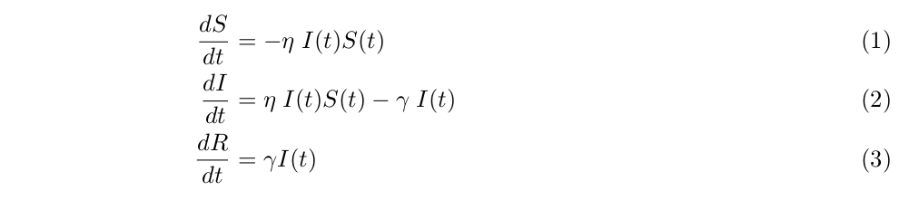

where 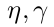 are the parameters of the model, t a discrete time index, and the state variables are fraction of the total population so that 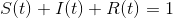.

We could make a simplifying assumption in the case of Wuhan. Since the population in question is large, the impact of the infection is insignificant relative to the size of the population. In a country of 1.4 billion, the current number of deaths from coronavirus is not even 0.01 percent of the population. Therefore, 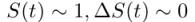, and 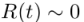. We could drop Equation (1) and (3), and Equ (2) becomes,

 
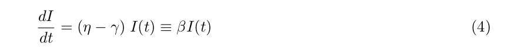

where I define 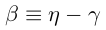.

By elementary calculus Equ (4) has solution

 
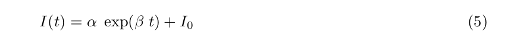

The rest is to fit this exponential function to the daily data. I use non-linear least squares in `R`. For coding details please consult `coronavirus.R`.

### Update (2/2)
Since the exponential model seems to overestimate the actual number of cases, an alternative is to fit a simple time trend linear model. See `coronavirus.R` for details. 

---

### Results
Beta, the rate of infection is dropping, as could be seen in Fig. 3.

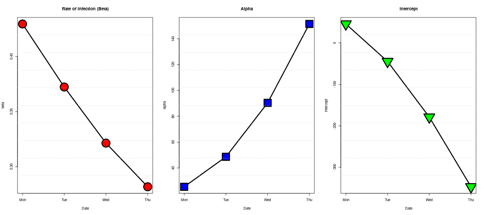

Fig. 4 is the prediction of the linear trend model. Notice the next-day infected cases is substantially lower.

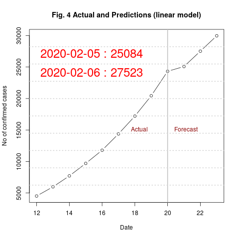

 
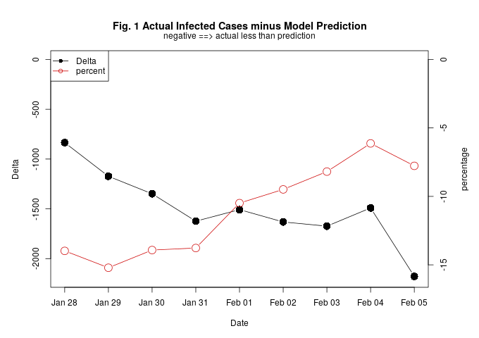

---

### Interpretation
Although the number of infected cases continue to rise, the rate of increase has been steadily declining. This is a sign that the lock-down is working.

---

### Generate Prediction
Open `corona_data.csv` with your favorite spreadsheet, e.g. Excel. Read off the latest statistics from [Wiki](https://en.wikipedia.org/wiki/Timeline_of_the_2019%E2%80%9320_Wuhan_coronavirus_outbreak) and enter them in last row.

Open a terminal, 

    Rscript coronavirus.R

After the script finishes, two files are generated : `latest-prediction.png` in the top directory, and `Beta-history.png` in subdirectory plots/. 

### Install Software
To install R, press Ctrl+Alt+T to open a terminal

    sudo apt-get update 
    sudo apt-get install r-base

### Dependencies
Code has been tested on 
* R 3.6.0
* Ubuntu 18.04 

### Contact
To ask questions or report issues, please open an issue on the [issues tracker](https://github.com/htso/Coronavirus_Epidemic/issues).

References

[1] Dye, C., & Gay, N. (2003). Modeling the SARS epidemic. Science, 300(5627), 1884-1885.

[2] Brauer, F. (2006). Some simple epidemic models. Mathematical Biosciences & Engineering, 3(1), 1.

[3] Naheed, A., Singh, M., & Lucy, D. (2014). Numerical study of SARS epidemic model with the inclusion of diffusion in the system. Applied Mathematics and computation, 229, 480-498.

[4] Newman, M. E. (2002). Spread of epidemic disease on networks. Physical review E, 66(1), 016128.

